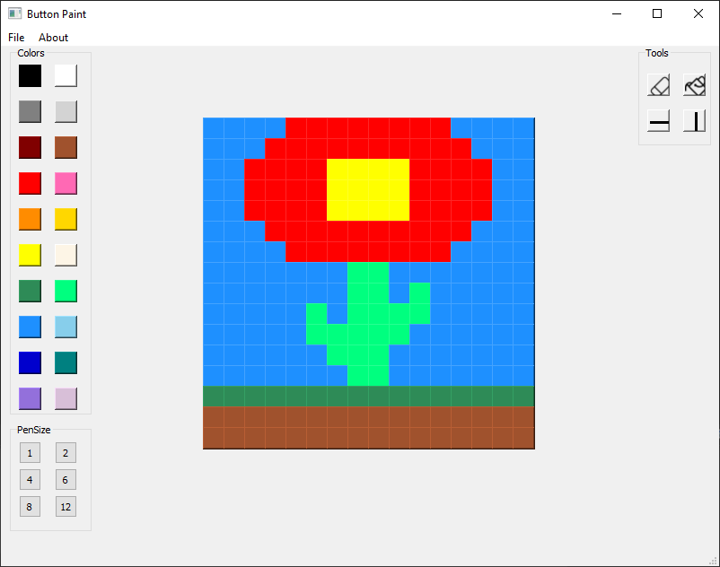

# Button-Paint
This is an updated version of the old Pixel Paint program. It was made in PyQt5 and features more functions than the previous program.

### About
-------------
This was my first program made with PyQt5. New improvements are new 20 colors to choose from, more image sizes and different fill picture options!  
Unfortunately, no export to .png or .jpg is available.  
WARNING! The images from old Pixel Paint are not compatible with Button Paint and vice versa.  

### Credits
-------------
Used assets:
<ul>
  <li>https://www.flaticon.com/free-icon/eraser_847452?term=eraser&page=1&position=2</li>
  <li>https://www.flaticon.com/free-icon/bucket_834205?term=bucket </li>
</ul>

### Getting Started
-------------
To compile this project, you will need at least Python 3.8.5.  
You will also need PyQt5. You can install it with pip: pip install PyQt5. 
You're free to modify the project as you wish.

### Preview
-------------

